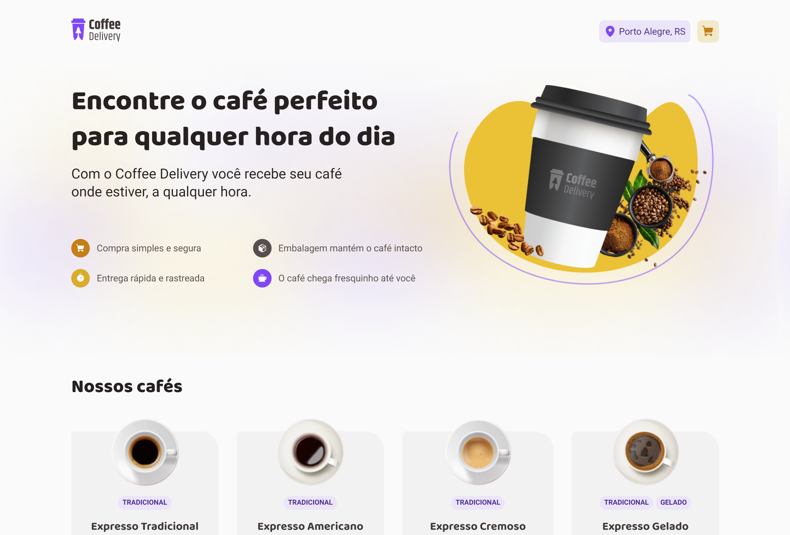

# Coffee Delivery

## Ignite | Rocketseat: Desafio React

## Sobre o projeto

Coffee Delivery é uma página web (SPA) de catálogo e compra de cafés desenvolvida com ReactJs.

Este projeto é um dos desafios da trilha de React do Ignite - Rocketseat.

## Tecnologias

- ReactJs
- Vite
- TypeScript
- Styled-comonents
- Context API
- React Hook Form
- Zod
- Immer
- Phosphor Icons
- Vercel

## Deploy

Este projeto foi publicado na **_Vercel_**.

[Clique aqui para visitar a página](https://ignite-coffee-delivery-ecru.vercel.app)
